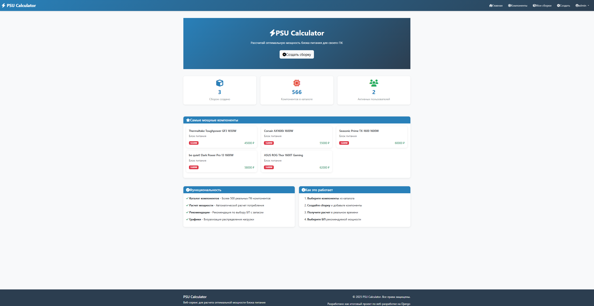
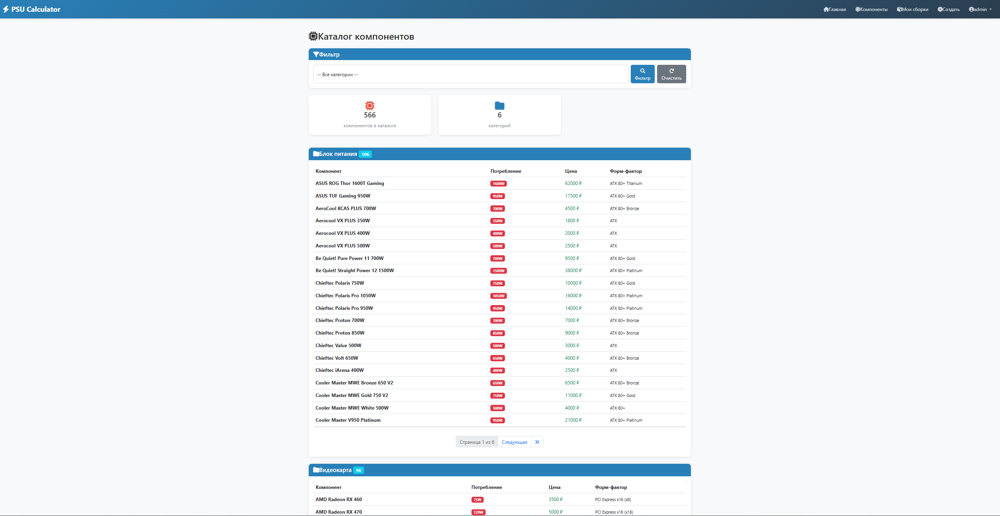
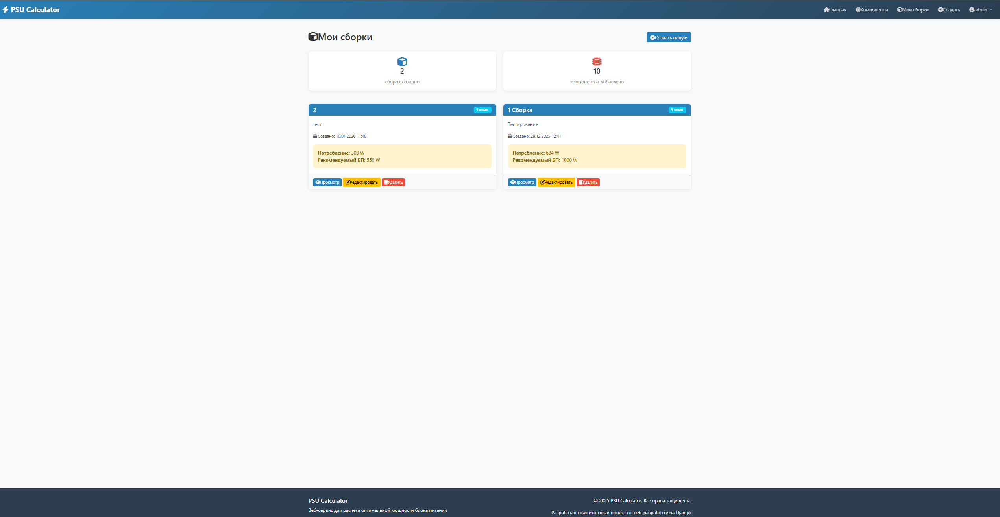
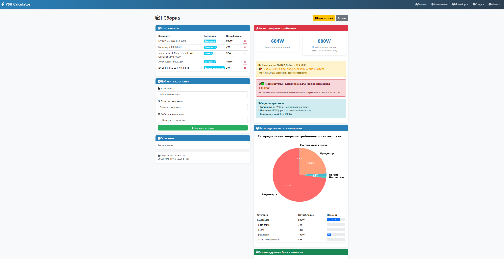
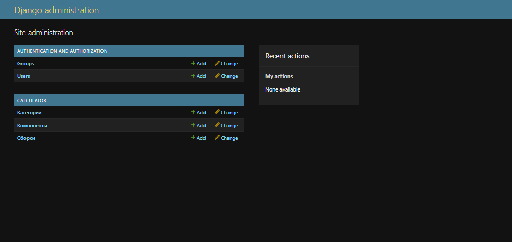

# PSU Calculator

Веб-сервис для расчета оптимальной мощности блока питания при сборке компьютера. Помогает пользователям подобрать БП на основе конфигурации компонентов с визуальной аналитикой распределения энергопотребления.

**Ссылка на проект:** https://nedarixxx.pythonanywhere.com

## Технологии

* **Backend:** Python 3.13+, Django 6.0
* **Database:** SQLite (разработка), PostgreSQL (production)
* **Data Science:** Pandas (агрегация данных), Matplotlib (генерация графиков)
* **Frontend:** Bootstrap 5.3, HTML5, CSS3, JavaScript
* **Хостинг:** PythonAnywhere

## Стек технологий (подробнее)

```
Django 6.0                - веб-фреймворк для разработки приложений
Pandas 2.3.3              - анализ и агрегация данных компонентов
Matplotlib 3.10.8         - генерация диаграмм и графиков мощности
Pillow 12.0.0             - обработка и кэширование изображений

Поддерживающие библиотеки:
├── NumPy 2.4.0           - численные вычисления для аналитики
├── python-dotenv 1.2.1   - управление переменными окружения
├── SQLparse 0.5.5        - парсинг SQL запросов
├── pytz 2025.2           - работа с временными зонами
├── six 1.17.0            - совместимость Python 2/3
├── fonttools 4.61.1      - обработка шрифтов для графиков
├── kiwisolver 1.4.9      - решатель ограничений для визуализации
├── contourpy 1.3.3       - построение контурных линий
└── cycler 0.12.1         - управление стилями графиков
```

## Функциональность проекта

### Для гостей:
- Просмотр каталога компонентов ПК
- Просмотр статистики (общее количество сборок, компонентов, пользователей)

### Для авторизованных пользователей:
- ✅ Создание собственных сборок ПК
- ✅ Добавление/удаление компонентов в сборку
- ✅ **Автоматический расчет суммарного энергопотребления**
- ✅ **Рекомендация по выбору блока питания** (с коэффициентом 1.25x)
- ✅ **Круговая диаграмма распределения нагрузки** по категориям (Matplotlib)
- ✅ Сохранение нескольких сборок
- ✅ Редактирование и удаление сборок

### Для администратора:
- Управление каталогом компонентов
- Добавление категорий и компонентов
- Просмотр статистики по пользователям

## Ключевые особенности

1. **Глубокая аналитика** (Pandas + Matplotlib)
   - Расчет потребления по категориям
   - Генерация pie-chart диаграмм
   - Вывод аналитических рекомендаций

2. **3 связанные модели** (согласно ТЗ)
   - Category (категория компонентов)
   - Component (конкретный компонент)
   - Build (пользовательская сборка)

3. **Качество кода**
   - PEP8 compliance
   - Django best practices
   - Чистая архитектура (views, models, forms, templates)


## 📸 Скриншоты

### 1. Главная страница
**[Скриншот: http://127.0.0.1:8000/ - Видна статистика сайта (количество пользователей, сборок, компонентов) и кнопки навигации]**



### 2. Каталог компонентов
**[Скриншот: http://127.0.0.1:8000/components/ - Видны компоненты, отсортированные по категориям (Процессоры, Видеокарты и т.д.), возможность поиска и фильтрации]**



### 3. Список и создание сборок
**[Скриншот: http://127.0.0.1:8000/builds/ - Видны все созданные пользователем сборки, кнопка добавления новой сборки]**



### 4. Детали сборки с аналитикой
**[Скриншот: http://127.0.0.1:8000/builds/<id>/ - Видны компоненты в сборке, таблица с расчетами (тип компонента, мощность, сумма), круговая диаграмма распределения нагрузки, рекомендация по выбору БП]**



### 5. Администраторская панель
**[Скриншот: http://127.0.0.1:8000/admin/ - Управление компонентами, категориями и сборками с поиском и фильтрацией]**




## Как запустить проект локально

### Шаг 1: Клонирование репозитория
```bash
git clone https://github.com/YOUR_USERNAME/psu-calculator.git
cd psu-calculator
```

### Шаг 2: Создание виртуального окружения
```bash
# Windows
python -m venv venv
venv\Scripts\activate

# Linux/Mac
python3 -m venv venv
source venv/bin/activate
```

### Шаг 3: Установка зависимостей
```bash
pip install -r requirements.txt
```

### Шаг 4: Миграции и инициализация БД
```bash
python manage.py migrate
python manage.py populate_data  # Заполнение тестовыми данными
python manage.py createsuperuser  # Создание администратора
```

### Шаг 5: Запуск сервера
```bash
python manage.py runserver
```

### Шаг 6: Откройте в браузере
```
http://127.0.0.1:8000/
```

**Админ-панель:** http://127.0.0.1:8000/admin/

## Структура проекта

```
psu-calculator/
├── psu_calculator/          # Главное приложение Django
│   ├── settings.py          # Настройки проекта
│   ├── urls.py              # URL маршруты
│   └── wsgi.py              # WSGI конфигурация
├── calculator/              # Основное приложение
│   ├── models.py            # 3 модели (Category, Component, Build)
│   ├── views.py             # Представления (с Pandas + Matplotlib)
│   ├── forms.py             # Формы Django
│   ├── admin.py             # Админ-панель
│   ├── urls.py              # URL маршруты приложения
│   ├── management/
│   │   └── commands/
│   │       └── populate_data.py  # Команда заполнения БД
│   └── templates/           # HTML шаблоны
├── docs/
│   └── screenshots/         # Скриншоты проекта
├── TZ.md                    # Техническое задание
├── README.md                # Этот файл
├── requirements.txt         # Зависимости
├── .gitignore               # Git исключения
└── db.sqlite3               # База данных (локально)
```

## Модели данных

### Category (Категория)
```python
- name: CharField              # "Процессор", "Видеокарта"
- slug: SlugField              # "processor", "gpu"
- description: TextField       # Описание категории
- icon: CharField              # Bootstrap icon class
```

### Component (Компонент)
```python
- name: CharField              # "Intel Core i7-13700K"
- category: ForeignKey         # Связь на Category
- power_draw: IntegerField     # Потребление в Ваттах (125W)
- price: IntegerField          # Цена в рублях
- description: TextField       # Характеристики
- created_at: DateTimeField    # Дата добавления
```

### Build (Сборка)
```python
- title: CharField             # "Мой игровой ПК"
- user: ForeignKey             # Владелец (User)
- components: ManyToManyField  # Набор компонентов
- description: TextField       # Примечания
- created_at: DateTimeField    # Дата создания
- updated_at: DateTimeField    # Дата изменения
```

## Использование Pandas и Matplotlib

### В views.py:

**Pandas** используется для агрегации данных:
```python
df = pd.DataFrame(data)
power_by_category = df.groupby('category')['power'].sum()
```

**Matplotlib** используется для генерации диаграмм:
```python
fig, ax = plt.subplots(figsize=(8, 6))
ax.pie(power_by_category.values, labels=power_by_category.index, autopct='%1.1f%%')
# Сохранение в base64 и передача в шаблон
```

## Скриншоты

*Будут добавлены после разработки фронтенда*

1. **Главная страница** - Статистика и ссылки на основной функционал
2. **Каталог компонентов** - Список всех доступных компонентов
3. **Сборка ПК** - Форма добавления компонентов и аналитика
4. **График распределения** - Pie chart с Matplotlib

## Инструкция по деплою на PythonAnywhere

### Шаг 1: Подготовка кода
1. Отредактируй `settings.py`:
   ```python
   ALLOWED_HOSTS = ['your-username.pythonanywhere.com', '127.0.0.1']
   STATIC_ROOT = os.path.join(BASE_DIR, 'static')
   DEBUG = False  # Для production
   ```

2. Сделай коммит и push:
   ```bash
   git add .
   git commit -m "Ready for deploy"
   git push origin main
   ```

### Шаг 2: На серверере PythonAnywhere

1. **Web console -> Bash:**
   ```bash
   git clone https://github.com/YOUR_USERNAME/psu-calculator.git
   cd psu-calculator
   python3.13 -m venv venv
   source venv/bin/activate
   pip install -r requirements.txt
   python manage.py migrate
   python manage.py createsuperuser
   python manage.py collectstatic
   ```

2. **Вкладка Web -> Add a new web app -> Manual configuration**
   - Virtualenv: `/home/YOUR_USERNAME/psu-calculator/venv`
   - Source code: `/home/YOUR_USERNAME/psu-calculator`

3. **WSGI configuration file** (замени содержимое):
   ```python
   import os
   import sys

   path = '/home/YOUR_USERNAME/psu-calculator'
   if path not in sys.path:
       sys.path.append(path)

   os.environ['DJANGO_SETTINGS_MODULE'] = 'psu_calculator.settings'

   from django.core.wsgi import get_wsgi_application
   application = get_wsgi_application()
   ```

4. **Static files:**
   - URL: `/static/`
   - Directory: `/home/YOUR_USERNAME/psu-calculator/static`

5. Нажми **Reload**

## Требования к функциональности

✅ **Планирование (20 баллов)**
- TZ.md - полное техническое задание
- .gitignore и requirements.txt
- README.md с инструкциями
- Регулярные осмысленные коммиты

✅ **Работа с данными (20 баллов)**
- 3 связанные модели (Category, Component, Build)
- ForeignKey и ManyToManyField
- Фильтрация и агрегация (Sum)

✅ **Техническая сложность (20 баллов)**
- Используются Pandas + Matplotlib для аналитики
- Расчеты по формулам (потребление × 1.25)
- Генерация графиков

✅ **Интерфейс и формы (20 баллов)**
- Django Forms с валидацией
- Bootstrap 5 дизайн
- Наследование шаблонов ()

✅ **Управление и Deploy (20 баллов)**
- Все модели в admin.py
- list_display и search_fields
- Деплой на PythonAnywhere с DEBUG=False

## Команды для разработки

```bash
# Создание миграций
python manage.py makemigrations

# Применение миграций
python manage.py migrate

# Запуск сервера
python manage.py runserver

# Вход в Django shell
python manage.py shell

# Сбор статических файлов (для production)
python manage.py collectstatic

# Заполнение БД тестовыми данными
python manage.py populate_data

# Создание суперпользователя
python manage.py createsuperuser
```

## Возможные ошибки и решения

**ошибка: ModuleNotFoundError: No module named 'pandas'**
```bash
pip install -r requirements.txt
```

**ошибка: AttributeError: module 'matplotlib' has no attribute 'use'**
- Добавь в views.py: `import matplotlib; matplotlib.use('Agg')`

**ошибка: DEBUG=True на production**
- Измени в settings.py: `DEBUG = False`

**ошибка: ALLOWED_HOSTS не содержит адрес хостинга**
- Добавь домен в ALLOWED_HOSTS в settings.py

## Контакты

Разработано как итоговый проект курса веб-разработки на Django.

---

**Статус проекта:** В разработке ✍️

*Последнее обновление: январь 2026*
